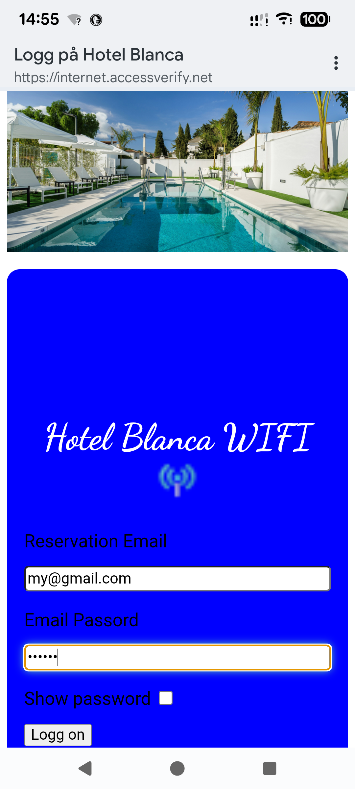

- Busy with wpa3 testing until 7/11-25 [Back to Line 1](#top)
- email-pishing as customportals on hold.
# Temporary_test_repo_for_Discord_friends
# Email_and_password phishing templates to replace  with the deafult content in /ag1/www/ when evil twin attack is running
- The https_plugin is used in the images.
- Only hackers mind limited way of use.
  e.g  QR code was used to test "consert".
- airgeddon https plugin templates bypass http warnings etc. Whiteout https-plugin templates still capture credentials & avoid check.php/ update.php  so php files don't interrupt email_phishing files.
- if not sure how to replace the files, se video below to get an idé.
"how to replace all files in ag1/www folder" start at ca 13.00 minut. Other stuff and code in video is very different and only for AP password.
 The www folder must bee open as root to replace files in the ag1/www folder.
- For test against targets like a school or whatever, just change the img+ text.
- Email validation, confirme password etc is done, templates act legit for victims.
- Email & password typed will popup as a  .txt file at /home/kali/Desktop.[ PATH can bee changed in check.htm line 17 ]
- Images of the 2 phishing templates how they look for victim on 2 different phones.
- If any question hit mee up on Dicord, or use email found at repos_overview.
-    

 - Video who shows how & where to replace all files in the ag1/www folder.Se from minut ~ 13.00:
- https://www.youtube.com/watch?v=fbmnzlNBIE0
- NB: This repo wil bee replaced with a new when small-fix is done.

<a id="top" >Back To Line 1</a>
