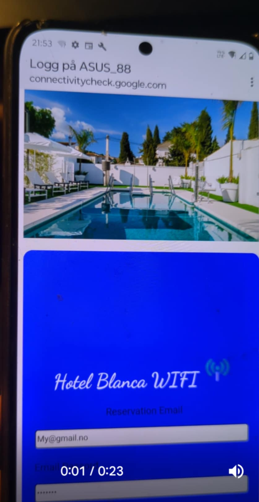

# Temporary_test_repo_for_Discord_friends
# Email_and_password phishing templates to replace  with the deafult content in /ag1/www/ when evil twin attack is running
- The templates can be tested on you own router, OR by deauth a Hotel / School etc router, OR by name you (portable) router to Hotel/School AP to fake a senario 100% legit by show target AP name displayed as available AP,insted of a router name.
- In the images I did so,+ https_plugin.
   Only hackers mind limited way of use.
  e.g  QR code was used to test "consert".
- If  hacker got airgeddon https plugin  templates will bypass http warnings etc. Whiteout https-plugin templates still capture credentials & overitte deafult text displayed for user(no check.php)
- if you'r not sure how to replace the files, se video below to get an idé.
Video is in spanish, forget everything    else then how to replace all files in ag1/www folder as code in video is very different and for AP password only.
 The www folder must bee open as root to replace all files in /www folder.
- If any question hit mee up on Dicord , - - or use email found at github overview.
- Remenber, you only need to replace image - and text to test against other targets,    like a school or whatever
- Templates for use  in                airgeddon/plugins/customportals will be added to this repo in a day or 2.
- This temporary repo will be replaced with a final email-pishing repo in a week.
  I just like to fix small things first.
- Email validation, confirme password etc is aldeady added to make templates act more legit and less suspicion for victims.
- Email & password typed will popup in a  txt file at you Desktop.
- Images of the 2 phishing templates how they look on victims phone
-    

 - Video who shows how & where to add the templates;
- https://www.youtube.com/watch?v=fbmnzlNBIE0
